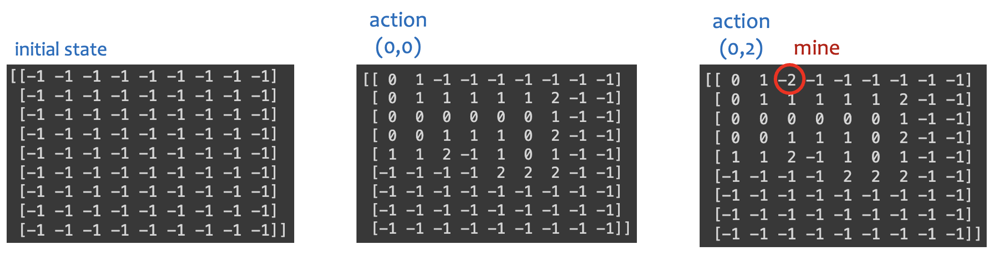
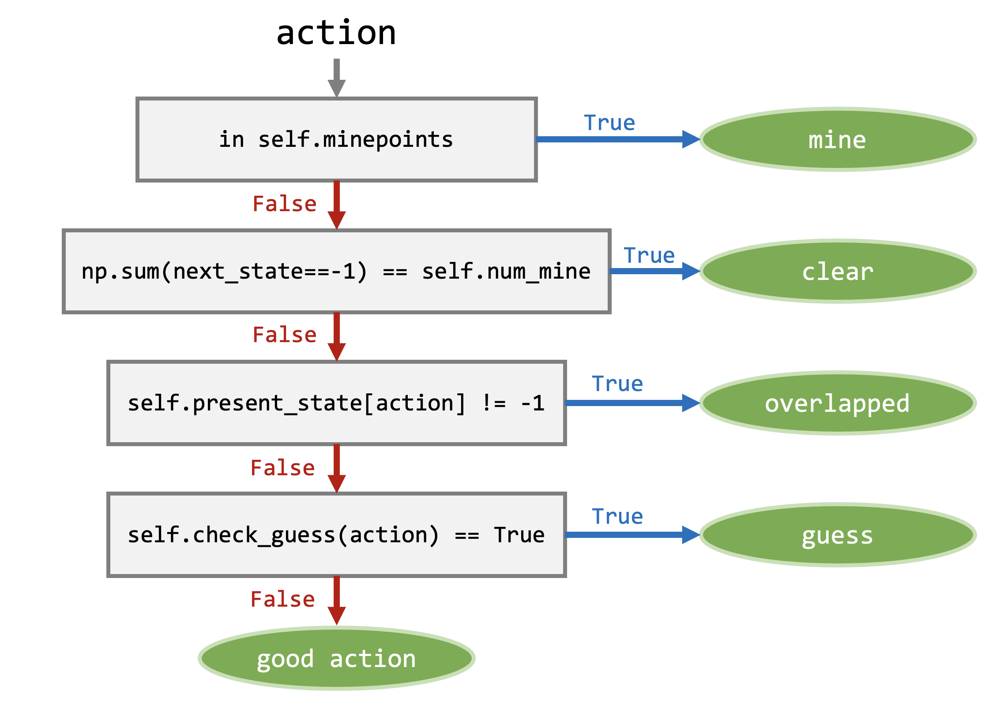
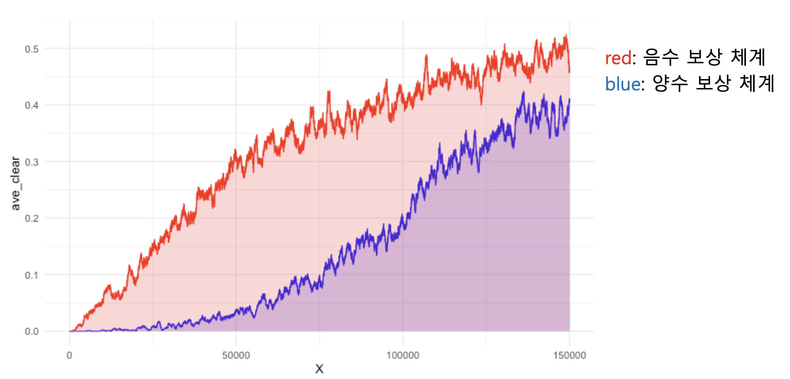
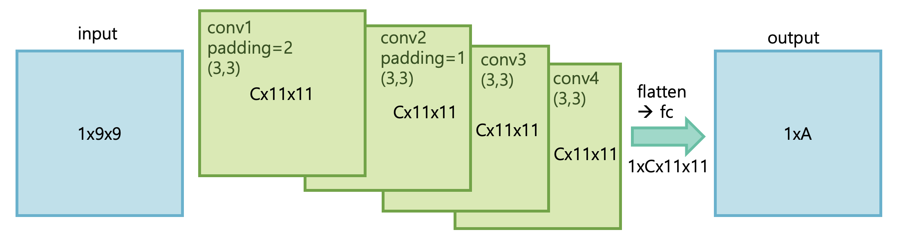
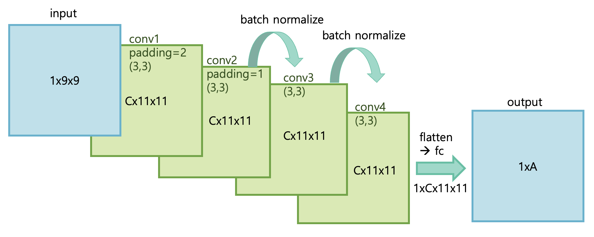
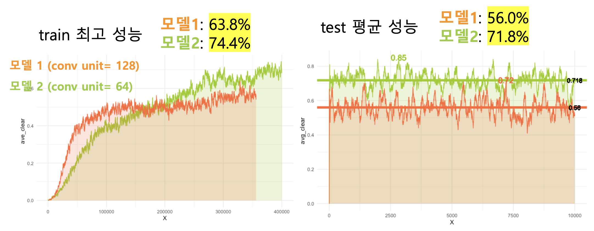

# 24-1-AI-EOD-01
[ 24-1 /  AI EOD / Team 01 ]  
👩‍💻 이승연, 변지은


---
# 1. Environment
## State

- (`nrow`, `ncol`) 차원의 행렬 (type: `np.ndarray`)

| 상황 | 표현 |
| --- | --- |
| 지뢰 | -2 |
| 가려진 타일 | -1 |
| 그 외 | 주변 지뢰의 개수를 나타내는 숫자 (0~8) |



<br>
<br>

## Reward Design

### reward 조건

- 지뢰 `mine`: 지뢰를 밟은 경우
- 성공 `clear`: 지뢰를 제외한 모든 좌표가 열린 경우
- 중복 행동 `overlapped`: 상태 맵에서 이미 열린 행동을 선택하는 경우
- 추측 행동 `guess`: 주변에 열린 좌표가 없는데 선택한 경우 (내장 함수로 판단)
- 좋은 행동 `empty`: 유효한 행동. 추측이나 중복이 아니고 지뢰가 아닌 행동



<br>
<br>

### 양수 보상 체계

|  | mine | clear | empty | overlapped | guess |
| --- | --- | --- | --- | --- | --- |
| reward | 0 | 0 | 1 | 0 | 0 |
| done | True | True | False | True | False |

- 양수 보상 체계에서는 “중복 선택 시 게임 종료” 조건이 필수적이다. 보상을 통해 중복 행동에서 빠져나오기 매우 어려운 구조이기 때문이다.

- 초반 낮은 성능에서 어느정도 수렴할 때 까지 가파른 기울기로 상승한다.

- 양수 보상 체계를 사용한 이유
    - 좋은 행동을 할 때만 양수의 보상 → 보상을 최대화 하도록 학습 → 성공률 상승
    - 에이전트가 좋은 행동만 하도록 학습하면 자연스럽게 성공률이 오를 것이라고 생각했다.

- 간과한 점
    - 클리어를 할 때의 이동 횟수가 모두 같지 않음. 즉, 보상이 높다고 클리어하는 것도 아니고 보상이 낮다고 클리어하지 않는 것도 아니다.
    - 클리어하는 경우에 보상을 추가로 더 크게 주는 것으로 위의 문제 상쇄 시도
    → 하지만 이동 횟수의 차이로 인해 최대 보상의 편차가 존재한다.
    - 결정적으로 “중복 선택 시 게임 종료”라는 조건이 학습 속도를 너무 느리게 하고, 지뢰찾기 게임과도 맞지 않는 조건이다.

<br>

### 음수 보상 체계

|  | mine | clear | empty | overlapped | guess |
| --- | --- | --- | --- | --- | --- |
| reward | -1 | 1 | 1 | -1 | 0.3 |
| done | True | True | False | False | False |

- 학습 초반부터 일정한 기울기로 성능이 향상한다.

- 지뢰의 보상을 아주 낮게 주는 것은 의미가 없다. 어차피 지뢰를 밟으면 끝이기 때문이고, 에이전트가 학습할 때 극단값이 생겨 학습에 혼돈이 생긴다. 게임 종료 시의 보상보다는 “좋은 행동”을 많이 하도록 유도하는 것이 핵심이다.

- 보상들의 비율
    - 경험 상 지뢰와 클리어의 보상은 비율을 맞추는 것이 좋다.
    - 하지만 게임을 진행하는 동안 발생하는 중복, 좋은 행동, 추측 보상의 비율을 맞추기보다는 중복 행동이 학습에 있어서 가장 큰 문제점이기 때문에 지뢰와 같은 가장 낮은 보상을 주었다.
    - 좋은 행동과 클리어는 모두 유도해야할 행동이므로 가장 큰 보상을 주었다.
    - 추측한 행동의 경우 지뢰나 중복보다는 나은 행동이고, 추측한 행동을 통해 운이 좋게 판이 열릴 수도 있기 때문에 작은 양수의 보상을 주었다.

- 클리어 보상의 크기가 너무 크면 안된다고 생각한다.(사고실험)
    - 클리어 보상의 크기가 다른 보상보다도 너무 큰 경우, 다른 어떤 행동을 해서라도 클리어만 하면 보상이 커지기 때문에 효율적으로 움직이지 않을 가능성이 있다. 즉, 좋은 행동을 할 유도가 작아진다.

- 전체적으로 보상의 크기가 크면 학습이 불안정하다. 따라서 모두 -1~1 사이의 값으로 설정했다.

<br>

### 양수 보상 체계 vs. 음수 보상 체계



- 음수 보상 체계인 경우에 일정한 기울기로 더 안정적인 성능 향상을 보인다.

<br>
<br>

## 속도 개선

- list 자료형 대신 np.array 자료형 사용
- for문 최소화 → numpy 함수 활용
- action: index (0~`nrow*ncol`-1)
    - `divmod()` 함수를 통해 좌표로 바꿔서 사용

<br>
<br>

## Render

- pandas.DataFrame으로 맵 시각화
- `render_answer()`, `render(state)` 함수로 구현
- `render_color()` 함수로 숫자별 색 적용


<br>
<br>

---

# 2. DQN Net

## Input

- `state_size`: 상태 사이즈 (nrow*ncol)
- `action_size`: action 개수, 마지막 전연결 층의 output 차원 (nrow*ncol)
- `conv_units`: 각 컨볼루션 레이어의 채널 개수 (64)

<br>

## 일반 CNN



```markdown
# 합성곱 층
self.conv1 = nn.Conv2d(in_channels=1, out_channels=conv_units, kernel_size=(3,3), bias=False, padding=2)
self.conv2 = nn.Conv2d(in_channels=conv_units, out_channels=conv_units, kernel_size=(3,3), bias=False, padding=1)
self.conv3 = nn.Conv2d(in_channels=conv_units, out_channels=conv_units, kernel_size=(3,3), bias=False, padding=1)
self.conv4 = nn.Conv2d(in_channels=conv_units, out_channels=conv_units, kernel_size=(3,3), bias=False, padding=1)

# 전연결 층
self.fc_size = conv_units * (state_size[-1]+2) * (state_size[-2]+2)
self.fc = nn.Linear(self.fc_size, action_size)
```

```markdown
# 순전파
x = F.relu(self.conv1(x))
x = F.relu(self.conv2(x))
x = F.relu(self.conv3(x))
x = F.relu(self.conv4(x))

# flatten
x = x.view(-1, self.fc_size)

# 완전 연결층
x = self.fc(x)
```

- 차원 ( C: conv_unit, A: action_size )
    
    
    | input | conv 1 (padding=2) | conv 2 | conv 3 | conv 4 | flatten | fc (output) |
    | --- | --- | --- | --- | --- | --- | --- |
    | 1x9x9 | C x 11 x 11 | C x 11 x 11 | C x 11 x 11 | C x 11 x 11 | 1 x C*11*11 | 1 x A |
- 활성화 함수: ReLU
- 총 4개의 컨볼루션 레이어 + 1개의 전연결 레이어
    - bias = False
    - kernel_size = (3,3)
    - padding = 2 → 1 ( 첫 번째만 2)

각 좌표의 주변 8칸의 정보를 통해 문제를 해결하는 지뢰찾기 게임의 특성을 살리기 위해 kernel size는 (3,3)으로 고정하였다. 같은 이유로 padding도 처음에만 2개로 해서 가장자리까지 (3,3)의 필터가 잘 탐색할 수 있도록 하고, 더이상 사이즈를 늘리지 않았다.

<br>

---

## CNN + Batch Normalize



```markdown
# 합성곱 층
## 컨볼루션 레이어
self.conv1 = nn.Conv2d(in_channels=1, out_channels=conv_units, kernel_size=(3,3), bias=False, padding=2)
## 컨볼루션 레이어 + 배치 정규화
self.conv2 = nn.Conv2d(in_channels=conv_units, out_channels=conv_units, kernel_size=(3,3), bias=False, padding=1)
self.bn2 = nn.BatchNorm2d(conv_units)
self.conv3 = nn.Conv2d(in_channels=conv_units, out_channels=conv_units, kernel_size=(3,3), bias=False, padding=1)
self.bn3 = nn.BatchNorm2d(conv_units)
## 컨볼루션 레이어
self.conv4 = nn.Conv2d(in_channels=conv_units, out_channels=conv_units, kernel_size=(3,3), bias=False, padding=1)

# 전연결 층
self.fc_size = conv_units * (state_size[-1]+2) * (state_size[-2]+2)
self.fc = nn.Linear(self.fc_size, action_size)
```

```markdown
# 순전파
x = F.relu(self.conv1(x))
x = F.relu(self.bn2(self.conv2(x)))
x = F.relu(self.bn3(self.conv3(x)))
x = F.relu(self.conv4(x))

# flatten
x = x.view(-1, self.fc_size)

# 완전 연결층
x = self.fc(x)
```

- 활성화 함수: ReLU
- 합성곱 층은 위와 동일
- 2, 3번째 컨볼루션 레이어 → 배치 정규화 → 활성화 함수

<br>

### Batch Normalization

- 학습 과정에서 각 배치 단위 별 다양한 분포를 가진 데이터를 **각 배치별로 평균과 분산을 이용해 정규화**하는 것
- **신경망 안에 포함**되어 학습시 평균과 분산으로 조정하는 과정
- 활성화 함수 앞에 적용
- 평균 0, 표준 편차 1인 가운데로 값들을 뿌려주기 때문에, 입력 값들에 대한 update 해야하는 편차들이 크지 않는다. 즉, Learning rate를 크게 해도 상관없다. → 빠르고 안정적인 학습 가능
- Regularization 효과가 있기 때문에 dropout을 안해도 되는 장점

> [train 단계에서의 수식]
<br>
$BN(X) = \gamma({{X-\mu batch}\over {\sigma batch}}) + \beta$

- $X$: 입력 데이터
- $\gamma$: 추가 스케일링
- $\beta$: 편향
- $\mu batch = {1\over B}\sum_{i}x_i$: 배치 별 평균값
- $\sigma batch = {1\over B}\sum_{i}(x_i- \mu batch)^2$: 배치 별 표준 편차

여기서 $\beta, \gamma$는 학습하는 파라미터이다. 이 파라미터는 신경망의 non-linearity를 유지하도록 해준다.

$\beta$가 있기 때문에 배치 정규화를 적용한 경우 신경망에서 편향을 넣을 필요가 없다.

> [test 단계에서의 수식]
<br>
$BN(X) = \gamma({{x-\mu BN}\over {\sigma BN}}) + \beta$

- $\mu BN = {1\over N}\sum_i \mu^i batch$
- $\sigma BN = {1\over N}\sum_i \sigma ^i batch$

추론 단계에 Batch Normalization을 적용할 때는 **학습 단계에서 배치 단위의 평균과 분산을 저장한 값**을 이용해 정규화한다.

모집단 추정 방식 또는 이동평균(Moving average) 방식을 이용해 구한 평균과 분산을 고정값으로 사용한다. 모집단 추정 방식의 경우 모든 mini batch의 평균, 분산 값을 저장하고 있어야 하므로 비효율적이다. 따라서 주로 이전 정보들을 바탕으로 모집단의 정보를 예측하는 방식인 Moving average방식을 사용한다.

참고: [https://velog.io/@js03210/Deep-Learning-Batch-Normalization-배치-정규화](https://velog.io/@js03210/Deep-Learning-Batch-Normalization-%EB%B0%B0%EC%B9%98-%EC%A0%95%EA%B7%9C%ED%99%94)

<br>

- - -

## 시행착오

### pooling

처음에는 Maxpooling을 적용했었다. 하지만 Maxpooling을 적용한 경우 학습이 전혀 되지 않아 삭제했다. 아마도 맵 사이즈가 9x9밖에 되지 않고, padding으로 사이즈를 늘려도 11x11이기 때문에 Maxpooling을 적용하면 사이즈가 5x5밖에 되지 않아 제대로 학습이 되지 않는 것 같다고 생각했다.

<br>

### Convolution filter 개수

이 신경망에서는 사용한 Convolution layer 4개의 filter 개수가 모두 입력받은 unit size로 고정이다. filter 개수가 많아질수록 많은 특징을 출력할 수 있지만, 그만큼 계산량이 많아져 속도가 느려지는 문제가 생길 수 있다.

결론적으로는 나머지 요인이 거의 같은 상황에서 conv_unit=64인 모델과 128개인 모델 중 64개인 모델의 성능이 더 높게 나왔다. 모두 배치 정규화를 적용한 신경망이었기 때문에 이미 속도가 느려진 상태라서 128개인 경우 속도가 너무 느려졌기 때문일 수 있다고 생각한다. 



<br>
<br>

---
---

# 3. DQN Agent

## Input

- `env`: 환경. 환경 관련 파라미터를 가져올 때 사용

<br>

---

## get_action

epsilon 탐험을 사용해 action을 선택한다. epsilon의 확률로 랜덤 action을 선택하며 탐험하고, 나머지 확률로 모델에서 계산한 q value의 최댓값을 action으로 선택한다.

> 중복 행동이 가능한 환경에서는 학습 중 무한 에피소드에 빠지는 문제를 방지하고자 최소 epsilon값을 0.01(1%)로 설정해 비교적 빠르게 무한 에피소드에서 빠져나올 수 있도록 했다. 대신 epsilon decay값을 크게 설정해 꽤 오랜 에피소드 동안 탐험하도록 했다.
> 

### gpu

- 환경에서 받은 `state`를 `torch.tensor` 타입으로 바꾸고, gpu에 올림
- q value를 model(gpu)에서 계산한 뒤, 최대 q값을 찾는 과정은 cpu에서 계산 (`torch.argmax()` 함수 사용 시 gpu에서 실행되지 않는 문제)

### 정규화

구현한 환경에서의 state의 최댓값이 8이므로 입력받은 state를 8로 나눠 간단하게 정규화했다.

- 정규화를 하지 않으면 데이터의 크기가 들쑥날쑥해 모델이 데이터 간 편차가 큰 Feature 위주로 학습이 진행되기 때문에 모델이 데이터를 이상하게 해석할 우려가 있다.

### 차원 문제

batch normalization을 적용한 신경망을 사용하는 경우, 차원의 첫 번째 원소가 batch size이기 때문에 action을 선택할 때 차원이 맞지 않는 문제가 생긴다. 따라서 batch normalization을 적용하지 않은 신경망을 사용할 때보다 `.unsqueeze(0)`를 한 번 더 적용해 차원을 맞춰준다.

<br><br>

---

## DQN 알고리즘

### replay memory

```python
self.memory = deque(maxlen = MEM_SIZE)
```

- `self.append_sample()` 함수를 통해 replay memory에 샘플 추가
    - 한 샘플: (state, action, reward, next_state, done, clear)

### model, target model

```python
self.model = DQN_Net(state_size, len(action), CONV_UNITS).to(self.device)
self.target_model = DQN_Net(state_size, len(action), CONV_UNITS).to(self.device)
self.update_target_model()
self.criterion = nn.MSELoss()
```

- `self.update_target_model()` 함수를 통해 일정 주기마다 target model 업데이트
- 오류 함수: nn.MSELoss()

model(DQN 신경망)에 대한 자세한 설명은 [2. DQN 신경망](#-dqn-신경망)

<br><br>

### train_model()

replay memory에서 BATCH_SIZE(64)만큼 mini batch를 뽑아 모델을 학습시킨다. state와 next state의 배치를 가져오는 과정에서 state 정규화를 한다.

> 미니배치에서 각 요소들을 가져와 `np.ndarray` 타입을 `torch.tensor` 타입으로 만드는 과정에서 list complication을 사용하는 것이 속도를 느리게 한다. 애초에 환경에서 `np.ndarray` 타입 대신 `torch.tensor` 타입을 사용하는 것을 고려 중이다.
> 

학습 시작 이후로 학습을 할 때마다 epsilon을 epsilon decay 만큼 감소시킨다.

[ 학습 과정 ]

```python
pred_q_values = self.model(states).gather(1, actions) # action idx의 데이터만 꺼냄
```

- 예측 값으로 Q(s, a)값 사용 (차원: (batch size, num actions))

```python
with torch.no_grad():
    next_q_values = self.target_model(next_states).max(1).values.reshape(-1,1)
    target_q_values = rewards + (torch.ones(next_q_values.shape, device=self.device) - dones) * self.gamma * next_q_values
```

- 타겟 값 계산: $reward + (1-done)\times gamma\times Q(s', a')$

```python
loss = F.mse_loss(pred_q_values, target_q_values)
```

- 오류 함수 (mse)를 줄이는 방향으로 모델을 업데이트

```python
self.optimizer.zero_grad()
loss.backward()
self.optimizer.step()
```

- 역전파 계산 후 기울기를 optimizer에 맞춰 가중치 수정

<br><br>

---

## Optimizer

Adam을 사용하였다. 

### SGD vs. Adam

> 학습이 되는지 여부를 확인하기 위해 게임판을 10개로 제한한 환경에서 비교해보았다.
> 

RAdam도 실험해보았지만 게임판 10개 제한 환경임에도 전혀 학습이 되지 않았다.

[ SGD ]

이후 추가.

[ Adam ]

이후 추가.

---

# Rule based

- 한번 밟은 곳은 다시 밟지 않는 규칙을 기계에게 알려준다.

## 1. Environment
### Reward Design
---

- 지뢰 `mine`: 지뢰를 밟은 경우
- 성공 `clear`: 지뢰를 제외한 모든 좌표가 열린 경우
- `empty`: 지뢰가 아닌 행동
```python
  self.reward_dict = {'mine': -8, 'empty':1, 'clear':5}
```

#### 양수 보상 체계

|  | clear | empty |  
| --- | --- | --- |
| reward | 5 | 1 | 
| done | True | False | 

- Rule based 에서는 중복 선택을 마스킹을 함으로써 막는다.

- empty reward
  - ver1. 한 에피소드 당, 누르는 횟수가 9번 이상 혹은 안 눌린 버튼이 30개 미만인 경우, machine 은 열려있는 판의 정보를 토대로 지       적인 추론을 해야한다고 판단하였다. 따라서 위의 2가지 경우, 한번 눌렀을 때 터지는 횟수를 `empty` 보상에 곱하여 더 큰 보상을 주었다.

      ```python
      reward = self.reward_dict['empty']
            if((self.totalcnt>8) or (np.sum(self.present_state == -2) < 30)):
                reward = self.reward_dict['empty'] * switch_cnt
            else:
                reward = self.reward_dict['empty']
            done = False
      ```
      
    - 간과한 점: 위의 두 가지의 경우, 한 게임에서 이미 많은 버튼을 누른 상태이기 때문에 좋은 판단을 한다고 해서 여러 좌표가 같이 터지는 것이 아니다. 오히려 나중에 밟는 좌표는 적게 터질 가능성이 크다. 따라서 `empty` 보상에 switch_cnt 를 곱하는 것이 지적인 활동을 학습시키는데 부적절하다고 판단하였다.
          
  - ver2. 한 에피소드 당, 만약 이미 터진 곳의 옆자리(누른 곳을 중심으로 한 3\*3 행렬) 가 이미 터져있을 때, 기계는 추론을 한 것이므로 더 큰 보상을 주도록 하였다. 예를 들어, 아래의 사진에서 빨간 점을 누른 다고 했을 때, 빨간 점을 중심으로 한 3*3 gird_world 를 탐색한다. 이 때, 이미 탐색 된 것(아래의 그림에서는 (2,3)) 이 있다면 3의 보상을 주었다. <br>

<p align="center">
  
</p>

      ```python
            reward = self.reward_dict['empty']
                pred = 0
                directions = [(-1, 0), (1, 0), (0, -1), (0, 1),
                        (-1, -1), (-1, 1), (1, -1), (1, 1)]
                for dx, dy in directions:
                    nx, ny = x + dx, y + dy
                    if 0 <= nx < self.nrow and 0 <= ny < self.ncol and self.present_state[nx, ny]!=-2:
                        pred+=1
                if pred > 0 :
                    reward = self.reward_dict['empty'] * 3
                else:
                    reward = self.reward_dict['empty']
                done = False
       ```
        
ver1 보다 ver2 의 보상 체계가 기계의 지적 추론에 도움이 될 것이라 판단하고 ver1 으로 400000 episode 학습시킨 것을 ver2 로 바꾸어 250000 정도 추가학습 시켰다.
   
<br>

#### 음수 보상 체계

|  | mine | 
| --- | --- | 
| reward | -8 |
| done | True |

- 음의 보상을 주는 경우는 지뢰를 밟는 경우로 설정을 하였다.
- `mine` 의 경우에 음의 보상을 너무 크게 주면, 전체의 보상이 음수가 되는데 이 때 학습 속도가 저하되는 것을 확인하여, 총 reward 의 합이 양수가 나오도록 적당한 음의 보상값을 설정하였다.

## 2. DQN Net

- DQN Net 은 4개의 CNN 층, 1개의 fc 층으로 설계하였다. batch normalization 의 경우, 4개의 CNN 층에 모두 적용하는 것보다, 일부에만 적용시키는 것이 초기에 성능이 수렴하는데 더 좋다는 것을 경험적으로 발견하였다. 또한, a* 알고리즘에 기반한 classification task 에 쓰이는 fc 층 지수승 감소가 오히려 이 task 에서 성능이 안 좋다는 것 또한 발견하여 fc layer 는 하나의 층으로 구성하였다.
  
```python
class DQN_Net(nn.Module):
    def __init__(self, state, action_size, conv_units=64):
        super().__init__()
        self.state_size = len(state) * len(state)
        self.conv1 = nn.Conv2d(in_channels=1, out_channels=conv_units, kernel_size=(3,3), bias=False, padding=1)
        self.bn1 = nn.BatchNorm2d(conv_units)
        self.conv2 = nn.Conv2d(in_channels=conv_units, out_channels=conv_units, kernel_size=(3,3), bias=False, padding=1)
        self.conv3 = nn.Conv2d(in_channels=conv_units, out_channels=conv_units, kernel_size=(3,3), bias=False, padding=1)
        self.conv4 = nn.Conv2d(in_channels=conv_units, out_channels=conv_units, kernel_size=(3,3), bias=False, padding=1)
        self.fc1 = nn.Linear(5184, action_size)

    def forward(self, x):
        x = F.relu(self.bn1(self.conv1(x)))
        x = F.relu(self.bn1(self.conv2(x)))
        x = F.relu(self.conv3(x))
        x = F.relu(self.conv4(x))

        # flatten
        x = x.view(-1, 5184)

        x = self.fc1(x)
        return x
```

## 3. CONFIG
DQN Agent 를 구현하기 위한 CONFIG 설정 값이다. 약 4300 EPISODE 정도 탐색을 할 수 있도록 `EPSILON`, `EPSILON_DECAY`, `EPSILON_MIN` 값을 설정하였다. 또한, LEARN_MAX 를 0.005로 크게 설정한 것을 볼 수 있는데, 초기에 큰 Learning rate 가 수렴 속도를 빠르게 한다는 것을 확인하였기 때문이다.

```python
MEM_SIZE = 50000
MEM_SIZE_MIN = 1000

BATCH_SIZE = 64
GAMMA = 0.1 #gamma


LEARN_MAX = 0.005
LEARN_MIN = 0.00005
LEARN_EPOCH = 2500
LEARN_DECAY = 0.99


EPSILON = 0.9997
EPSILON_DECAY = 0.9997
EPSILON_MIN = 0.001

CONV_UNITS = 64
DENSE_UNITS = 512
UPDATE_TARGET_EVERY = 5

EPISODES = 60000
PRINT_EVERY=100
SAVE_EVERY=1000
```

## 4. DQN Agent

DQN 에서 행동을 선택할 때, 2가지의 경우가 있다. 하나는 탐색으로 무작위로 하나를 뽑는 것이다. 현 모델을 Rule based 이기 때문에 밟지 않은 좌표 중 아무거나 하나를 반환하도록 설계하였다.
나머지 하나는 탐욕 정책을 따르는 것인데, state 를 입력으로 주었을 때 가장 큰 q 값을 가진 action 을 반환하는 것이다. 따라서 밟지 않은 좌표 중 가장 큰 q 값을 가지는 것을 반환하도록 하였다. 이 때, 가장 큰 값을 구하기 위하여 밟은 곳은 -inf 마스킹을 해주어 양수, 음수 구분을 따로 하지 않고 한번에 최댓값을 반환할 수 있도록 하여 시간복잡도를 낮추었다.

```python
def get_action(self, state):
        state = torch.tensor(state)
        if np.random.rand() <= self.epsilon:  # 무작위 탐색
            valid_indices = (state == -2).nonzero(as_tuple=True)

            rand_idx = np.random.randint(len(valid_indices[0]))
            x, y = valid_indices[0][rand_idx].item(), valid_indices[1][rand_idx].item()

            return x, y

        else: # 가장 큰 q 값의 action 추출
            state = state.unsqueeze(0).unsqueeze(0).to(dtype=torch.float).to(device) 
            with torch.no_grad():
                q_values = self.model(state).flatten()

                flat = state.squeeze(0).flatten()
                mask = (flat == -2).float()

                masked_q_values = q_values * mask
                masked_q_values[mask == 0] = float('-inf')

                max_q_value, action_idx = torch.max(masked_q_values, dim=-1)

                x = action_idx // self.n
                y = action_idx % self.n

                self.action = [item for item in self.action if item != (x, y)]
                return x, y
```

train_model 함수

Rule based 는 No Rule based 와 train_model 을 다르게 설계하였다. <br>
Rule based 에선 next_state 를 input 으로 받고 최대 q 값을 반환하는 target model 에도 밟은 곳은 또 밟지 않는다는 것을 알려주기 위해 마스킹 작업을 하였다. 

- 예측 값으로 Q(s, a)값 사용

```python
with torch.no_grad():
            next_q_values = self.target_model(next_states).flatten(1)
            flat_next_states = next_states.squeeze(1).flatten(1)
            valid_mask = (flat_next_states == -2).float()
            valid_next_q_values = next_q_values * valid_mask
            valid_next_q_values[valid_mask == 0] = float('-inf')
            max_valid_q_values, _ = torch.max(valid_next_q_values, dim=-1)
            target_q_values = rewards + (torch.ones_like(dones) - dones) * GAMMA * max_valid_q_values

```

- 타겟 값 계산: $reward + (1-done)\times gamma\times Q(s', a')$

```python
loss = F.mse_loss (predicts, target_q_values)
```

- 오류 함수 (mse)를 줄이는 방향으로 모델을 업데이트

```python
self.optimizer.zero_grad()
loss.backward()
self.optimizer.step()
```

- CONFIG 에서 설정한 LEARN_EPOCH 마다 LEARN_DECAY 만큼 lr 감쇠

```python
if (episode+1) % LEARN_EPOCH == 0:
    lr = agent.optimizer.param_groups[0]['lr'] * LEARN_DECAY
    agent.optimizer.param_groups[0]['lr'] = max(lr, LEARN_MIN)
```
## 5. 결과

### train
- 65만 episode 중 후기 15만 episode 의 성능 지표이다.
- 약 5만 episode 마다 median cnt 가 하나씩 늘어나는 것을 알 수 있으며, avg clear 로 보아 train 시 성능이 약 30% 대에 수렴하는 것을 알 수 있다.


### test
- test 는 model 을 evaluation 모드로 바꾸고, 탐색하는 과정을 없앴다.
- 1만 EPISODE 로 테스트를 진행하고, 성능을 100 EPISODE 마다 기록하였다. Rule based 시, 최대 100 번 테스트 당 47 번 `CLEAR` 하는 것을 알 수 있고 평균 약 28% 의 성능을 내는 것을 확인하였다.
  

